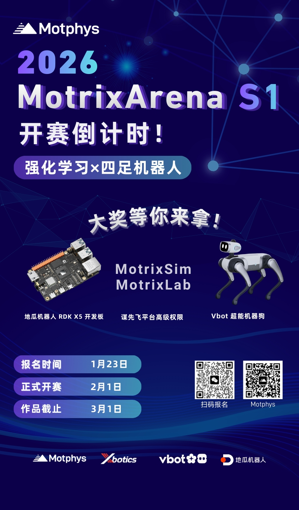

**语言**: [English](README.md) | [简体中文](README.zh-CN.md)

# MotrixArena-S1

- 这是 MotrixLab 的 MotrixArena-S1 分支。本活动仅限此分支。
- **请从 https://dist.bj.bcebos.com/motphys-arena/starter_kit.zip 下载 ARENA 的资源文件**
- 关于我们活动的更多信息：



# MotrixLab


`MotrixLab` 是一个基于 [MotrixSim](https://github.com/Motphys/motrixsim-docs) 仿真引擎的强化学习框架，专为机器人仿真和训练设计。该项目提供了一个完整的强化学习开发平台，集成了多种仿真环境和训练框架。

## 项目概述

该项目分为两个核心部分：

- **motrix_envs**: 基于 MotrixSim 构建的各种 RL 仿真环境，定义了 observation、action、reward。与具体的 RL 框架无关，目前支持 MotrixSim 的 CPU 后端
- **motrix_rl**: 集成 RL 框架，并使用 motrix_envs 里的各种环境参数进行训练。目前支持 SKRL 框架的 PPO 算法

> 文档地址：https://motrixlab.readthedocs.io

## 主要特性

- **统一接口**: 提供简洁统一的强化学习训练和评估接口
- **多后端支持**: 支持 JAX 和 PyTorch 训练后端，可根据硬件环境灵活选择
- **丰富环境**: 包含基础控制、运动、操作等多种机器人仿真环境
- **高性能仿真**: 基于 MotrixSim 的高性能物理仿真引擎
- **可视化训练**: 支持实时渲染和训练过程可视化

## 🚀 快速开始

> 以下示例使用了 Python 项目管理工具：[UV](https://docs.astral.sh/uv/)
>
> 在开始之前，请先[安装](https://docs.astral.sh/uv/getting-started/installation/)该工具。

### 克隆仓库

```bash
git clone https://github.com/Motphys/MotrixLab

cd MotrixLab

git lfs pull
```

### 安装依赖

安装全部依赖：

```bash
uv sync --all-packages --all-extras
```

SKRL 框架支持 JAX(Flax)或 PyTorch 作为训练后端，您也可以根据自己的设备环境，选择只安装其中一种训练后端：

安装 JAX 作为训练后端（仅支持 Linux 平台）：

```bash
uv sync --all-packages --extra skrl-jax
```

安装 PyTorch 作为训练后端：

```bash
uv sync --all-packages --extra skrl-torch
```

## 🎯 使用指南

### 环境可视化

查看环境而不执行训练：

```bash
uv run scripts/view.py --env cartpole
```

### 训练模型

```bash
uv run scripts/train.py --env cartpole
```

训练结果会保存在 `runs/{env-name}/` 目录下。

通过 TensorBoard 查看训练数据：

```bash
uv run tensorboard --logdir runs/{env-name}
```

### 模型推理

```
uv run scripts/play.py --env cartpole
```

更多使用方式请参考[用户文档](https://motrixlab.readthedocs.io)

## 📬 联系方式

有问题或建议？欢迎通过以下方式联系我们：

- GitHub Issues: [提交问题](https://github.com/Motphys/MotrixLab/issues)
- Discussions: [加入讨论](https://github.com/Motphys/MotrixLab/discussions)
